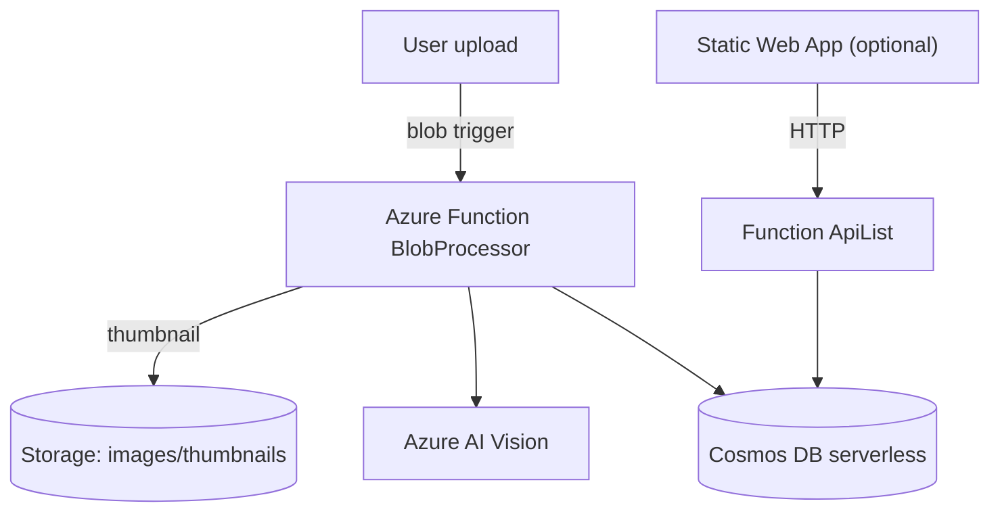

# Azure AI Image Pipeline — One Pager

**Goal**  
Show a serverless, AI-powered image pipeline on Azure: upload → thumbnail → Vision tags/captions → metadata in Cosmos DB → optional gallery API/UI.

**Repository**  
https://github.com/kevinsantiagomatos/Azure-Function-Vision-Demo

## Architecture


## Security
- Managed identity for Function; secrets in Key Vault (KV references).
- Optional private endpoints for Storage/Cosmos/KV with private DNS.
- HTTPS-only; TLS 1.2; private containers by default.

## Cost controls
- Serverless Cosmos + Function consumption plan.
- Vision can use the free tier (`vision_sku = "F0"`).
- Blob lifecycle deletes after 90 days (tunable).
- Optional budget alert variable.
- Safe default: project is **not deployed** until you run `terraform apply`.

## How to run (demo) and tear down
```bash
cd infra/terraform
terraform init
terraform plan -var-file=dev.tfvars
terraform apply -var-file=dev.tfvars   # deploy for demo

# tear down immediately after
terraform destroy -var-file=dev.tfvars
```

## What I learned / skills
- Terraform on Azure: Functions, Storage, Cosmos, Key Vault, private endpoints, budgets.
- Serverless eventing with blob triggers; Vision SDK integration; thumbnailing with Pillow.
- Securing apps with managed identities and KV references.
- Observability basics with Application Insights.
- Cost-aware architecture and teardown discipline.

## Export to PDF
- Open this file in GitHub (or your editor’s preview), Print → Save as PDF.  
- Add your name/contact in the header/footer if desired.
